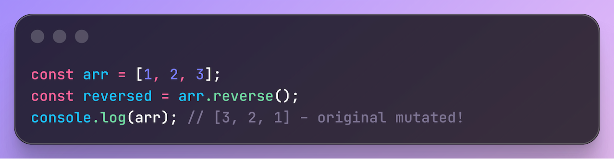
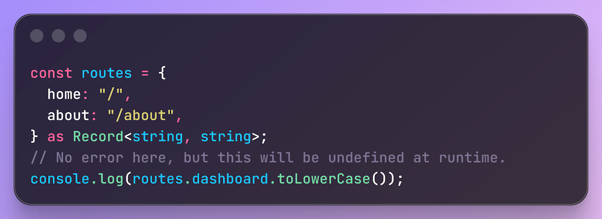
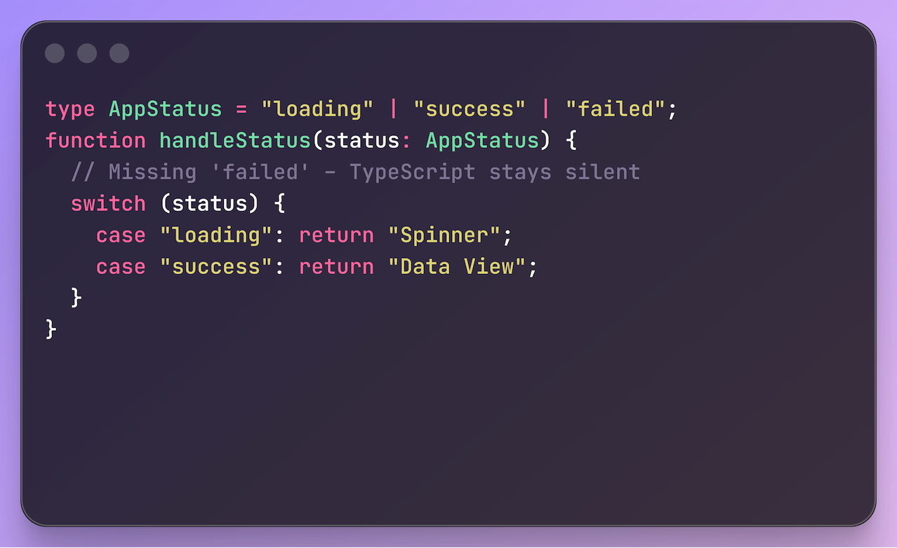

= 🛠️ AI Agent Skill – TypeScript
:toc: macro
:toc-title: Quick Navigation
:icons: font
:node-version: ^22.18.0
:ts-version: ^5.0.0

[.text-center]

'''

image:https://badgen.net/npm/v/hardwired-skill-typescript?icon=npm&label=npm&color=dd3636[NPM Version, link=https://npmjs.com/package/hardwired-skill-typescript]

image:https://img.shields.io/badge/→-.agent-9d00ff?style=flat-square&logo=smartthings&logoColor=white[Target: .agent directory]
image:https://img.shields.io/badge/→-.cursor-5456f5?style=flat-square&logo=cursor&logoColor=white[Target: .cursor directory]
image:https://img.shields.io/badge/→-.github-0fbf3e?style=flat-square&logo=githubcopilot&logoColor=white[Target: .github directory]
image:https://img.shields.io/badge/→-AGENTS.md-9d00ff?style=flat-square&logo=smartthings&logoColor=white[Target: AGENTS.md]
image:https://img.shields.io/badge/→-CLAUDE.md-d97752?style=flat-square&logo=anthropic&logoColor=white[Target: CLAUDE.md]
image:https://img.shields.io/badge/→-CURSOR.md-5456f5?style=flat-square&logo=cursor&logoColor=white[Target: CURSOR.md]

*Opinionated, pure TypeScript rules* designed to be reused as a shared skill or injected directly into project AI instruction files.

This skill focuses *exclusively* on the TypeScript language and coding practices—it is *not* a *framework-specific* skill (no NestJS, Angular, Vue, React, etc.)

A reusable, configurable skill that injects strict TypeScript coding rules into AI context files (such as `AGENTS.md`, `CLAUDE.md`, `.agent/` and `.cursor/` directory).

Enforce immutability, type safety, strict linting, and coding standards across every LLM-based coding assistant—*Cursor*, *Claude Code*, *GitHub Copilot*, *Windsurf*, *Codex*, and more—via `AGENTS.md`, `CLAUDE.md`, and Copilot instructions etc.

toc::[]

== ✨ Features

[glist]
🎯 *Opinionated TypeScript Rules*:: Curated best practices, strict type safety, and clean code conventions.
🔌 *Multi-Target Injection*:: Native support for `AGENTS.md`, `CURSOR.md`, `CLAUDE.md`, Copilot instructions, and dedicated agent directories.
⚡ *Interactive CLI*:: Pick and choose which rules and formats to deploy via terminal prompts.
📦 *Shared Dependency*:: Install via npm to keep your AI prompts synchronized across multiple repositories.

== 📍 What it does

Real-world codebases have *low-quality-do-not-overengineer-it-we-have-a-release-soon* code.

Your LLM was trained on plenty of code like this. This skill guides AI to fix obvious issues and enforce best practices.

== 📦 Installation

=== 1. Install as a dev dependency
[source,shell]
----
npm install -D hardwired-skill-typescript
----

=== 2. Install everything (for experimentation)
[source,shell]
----
npx hardwired-install-typescript --all
----

=== 3. Targeted universal setups
Install `.agent/` directory and `AGENTS.md` file for *universal* AI configurations (for those agents that support it):

[source,shell]
----
npx hardwired-install-typescript --agentdir --agentsmd
----

NOTE: For *all* CLI options, flags, and target-specific setup see link:./INSTALL.md[*INSTALL.md*].

== 📖 Documentation and Principles

* The single source of truth for all rules is link:./principles.md[`principles.md`].
* For the full categorized rules reference see link:./ACKNOWLEDGMENTS.md[*ACKNOWLEDGMENTS].

== ⚙️ Prerequisites

[square]
* *Node.js*: `{node-version}` or higher (recommended)
* *TypeScript*: `{ts-version}` or higher (to support features like `satisfies`)
